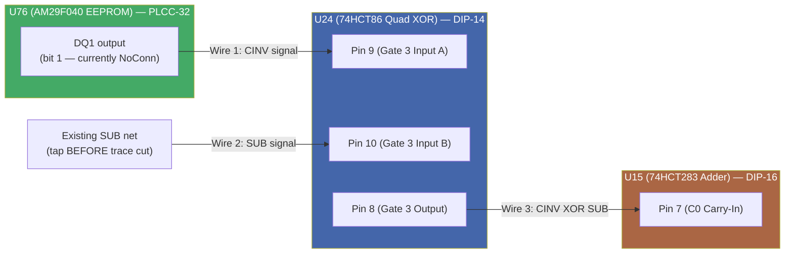
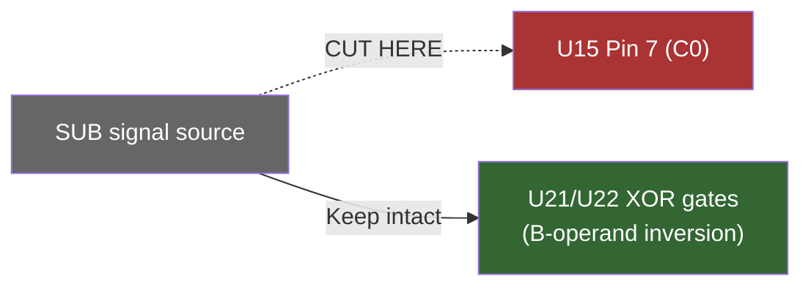
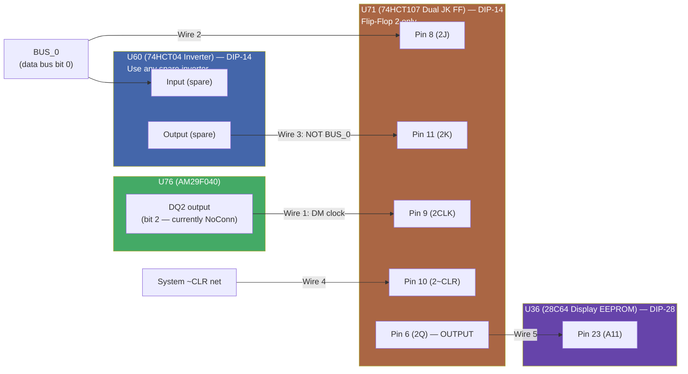
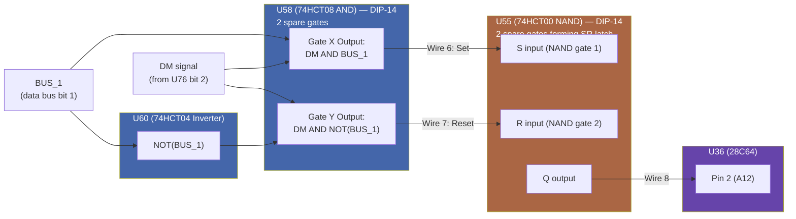
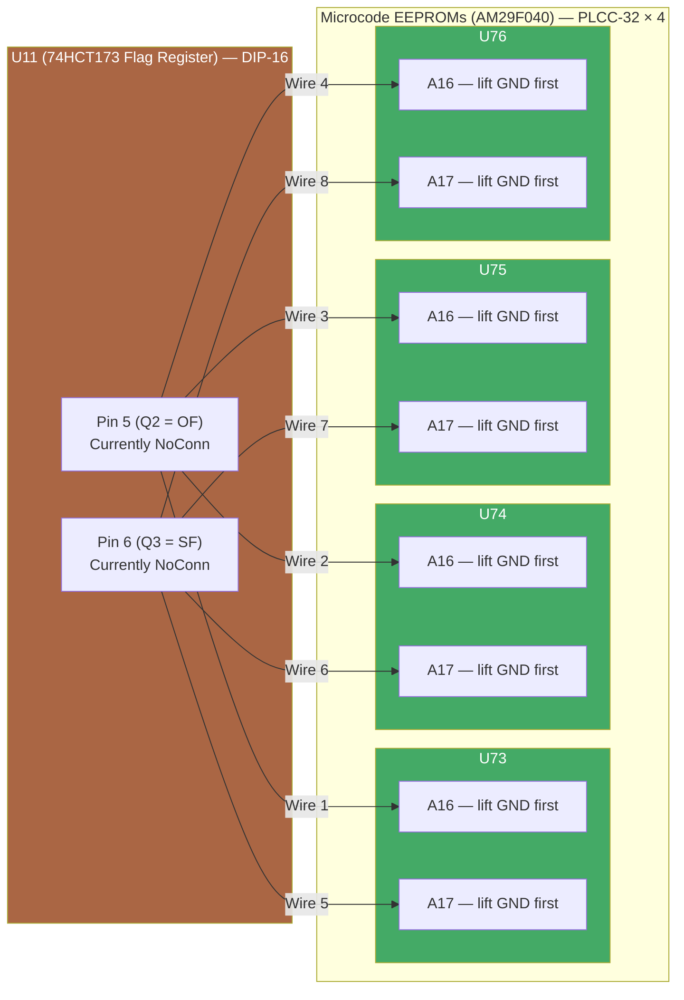
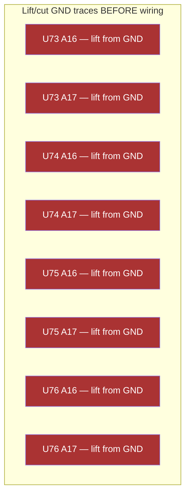
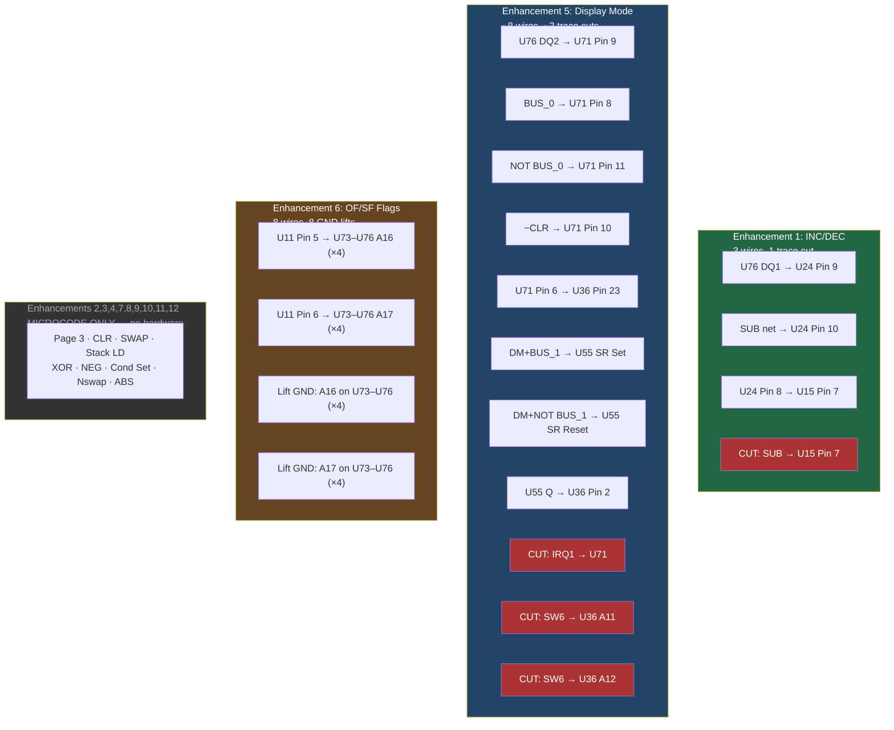

# MK1 CPU — Bodge Wire Diagrams

Pin-level wiring diagrams for all hardware enhancements. Verify physical pin numbers against manufacturer datasheets before soldering.

---

## Enhancement 1: INC/DEC — ALU Carry-In Modification

### Trace Cut

> **Critical:** The SUB net splits to (a) XOR gates U21/U22 for B-operand inversion and (b) U15 C0 carry-in. Cut ONLY the branch to C0. Verify the split point on your PCB before cutting.

---

## Enhancement 5: Display Mode Control

### U71 Flip-Flop (Mode Bit 0)

### SR Latch (Mode Bit 1)

### Trace Cuts for Enhancement 5

---

## Enhancement 6: OF/SF Flags — EEPROM Address Wiring

### GND Lifts for Enhancement 6

> **PLCC-32 pin numbers for A16 and A17:** Consult the AM29F040B datasheet for your specific chip revision. These pins are typically on the top edge of the PLCC-32 package near pin 1. All four EEPROMs (U73–U76) use the same pinout.

> **Pre-check:** Probe U11 pins 5 and 6 with a scope during ALU operations to confirm they carry distinct OF and SF signals before committing to any GND lifts.

---

## All Hardware Changes — Summary

> **Total physical work:** ~19 bodge wires + 4 trace cuts + 8 GND lifts. Nine of the twelve enhancements require zero hardware changes.
